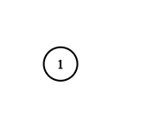
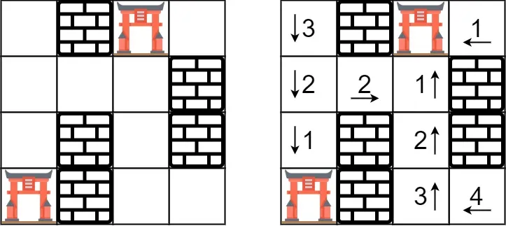

# 2. Add two numbers

## Description

You are given two non-empty linked lists representing two non-negative integers. The digits are stored in reverse order and each of their nodes contain a single digit.

Add the two numbers and return it as a linked list.

You may assume the two numbers do not contain any leading zero, except the number 0 itself.

## Examples

```text
Input: (2 -> 4 -> 3) + (5 -> 6 -> 4)
Output: 7 -> 0 -> 8

Explanation: 342 + 465 = 807.
```

## How to Run in main.rs

Put the code below in main.rs and run `cargo run`

```rust
    use leetcode::medium::add_two_numbers::ListNode;
    let l1 = ListNode::from_vec(vec![2, 4, 3]);
    let l2 = ListNode::from_vec(vec![5, 6, 4]);
    let result = leetcode::medium::add_two_numbers::add_two_numbers(l1, l2);
    println!("result: {:?}", result);
```

# 3. Longest Substring Without Repeating Characters

## Description

Given a string, find the length of the longest substring without repeating characters.

## Examples

```text
Input: "abcabcbb"
Output: 3

Explanation: The answer is "abc", with the length of 3.
```

## How to Run in main.rs

Put the code below in main.rs and run `cargo run`

```rust
  let s = String::from("abcabcbb");
  let result = leetcode::medium::longest_substring_without_repeating_characters::length_of_longest_substring(s);
  println!("result: {}", result);
```

# 5. Longest Palindromic Substring

## Description

Given a string s, find the longest palindromic substring in s. You may assume that the maximum length of s is 1000.

## Examples

```text
Input: "babad"
Output: "bab"

Note: "aba" is also a valid answer.
```

## How to Run in main.rs

Put the code below in main.rs and run `cargo run`

```rust
  let s = String::from("babad");
  let result = leetcode::medium::longest_palindromic_substring::longest_palindrome(s);
  println!("result: {}", result);
```

# 11. Container With Most Water

## Description

Given n non-negative integers a1, a2, ..., an , where each represents a point at coordinate (i, ai). n vertical lines are drawn such that the two endpoints of line i is at (i, ai) and (i, 0). Find two lines, which together with x-axis forms a container, such that the container contains the most water.

Note: You may not slant the container and n is at least 2.

## Examples

```text
Input: [1,8,6,2,5,4,8,3,7]
Output: 49
```

## How to Run in main.rs

Put the code below in main.rs and run `cargo run`

```rust
  let height = vec![1, 8, 6, 2, 5, 4, 8, 3, 7];
  let result = leetcode::medium::container_with_most_water::max_area(height);
  println!("result: {}", result);
```

# 15. Three sum

## Description

Given an array nums of n integers, are there elements a, b, c in nums such that a + b + c = 0?

Find all unique triplets in the array which gives the sum of zero.

Note:
The solution set must not contain duplicate triplets.

## Examples

```text
Given array nums = [-1, 0, 1, 2, -1, -4],
Output:
[
  [-1, 0, 1],
  [-1, -1, 2]
]
```

## How to Run in main.rs

Put the code below in main.rs and run `cargo run`

```rust
  let nums = vec![-1, 0, 1, 2, -1, -4];
  let result = leetcode::medium::three_sum::three_sum(nums);
  println!("result: {:?}", result);
```

# 16. Three sum closest

## Description

Given an array nums of n integers and an integer target, find three integers in nums such that the sum is closest to target.

Return the sum of the three integers.

You may assume that each input would have exactly one solution.

## Examples

```text
Given array nums = [-1, 2, 1, -4], and target = 1.
The sum that is closest to the target is 2. (-1 + 2 + 1 = 2).
```

## How to Run in main.rs

Put the code below in main.rs and run `cargo run`

```rust
  let nums = vec![-1, 2, 1, -4];
  let target = 1;
  let result = leetcode::medium::three_sum_closest::three_sum_closest(nums, target);
  println!("result: {}", result);
```

# 17. Letter Combinations of a Phone Number

## Description

Given a string containing digits from 2-9 inclusive, return all possible letter combinations that the number could represent.

A mapping of digit to letters (just like on the telephone buttons) is given below. Note that 1 does not map to any letters.

## Examples

```text
Input: "23"
Output: ["ad", "ae", "af", "bd", "be", "bf", "cd", "ce", "cf"].
```

## How to Run in main.rs

Put the code below in main.rs and run `cargo run`

```rust
  let digits = String::from("23");
  let result = leetcode::medium::letter_combinations_of_a_phone_number::letter_combinations(digits);
  println!("result: {:?}", result);
```

# 19. Remove Nth Node From End of List

## Description

Given a linked list, remove the n-th node from the end of list and return its head.

## Examples

```text
Given linked list: 1->2->3->4->5, and n = 2.
After removing the second node from the end, the linked list becomes 1->2->3->5.
```

## How to Run in main.rs

Put the code below in main.rs and run `cargo run`

```rust
    use leetcode::medium::remove_nth_node_from_end_of_list::ListNode;
    let head = ListNode::from_vec(vec![1, 2, 3, 4, 5]);
    let result = leetcode::medium::remove_nth_node_from_end_of_list::remove_nth_from_end(head, 2);
    println!("result: {:?}", result);
```

# 22. Generate Parentheses

## Description

Given n pairs of parentheses, write a function to generate all combinations of well-formed parentheses.

## Examples

```text
Input: n = 3
Output: [
  "((()))",
  "(()())",
  "(())()",
  "()(())",
  "()()()"
]

Input: n = 1
Output: ["()"]
```

## How to Run in main.rs

Put the code below in main.rs and run `cargo run`

```rust
  let n = 3;
  let result = leetcode::medium::generate_parentheses::generate_parenthesis(n);
  println!("result: {:?}", result);
```

# 36. Valid Sudoku

## Description

Determine if a 9x9 Sudoku board is valid. Only the filled cells need to be validated according to the following rules:

1. Each row must contain the digits 1-9 without repetition.
2. Each column must contain the digits 1-9 without repetition.
3. Each of the 9 3x3 sub-boxes of the grid must contain the digits 1-9 without repetition.

## Examples

```text
Input:
[
  ["5","3",".",".","7",".",".",".","."],
  ["6",".",".","1","9","5",".",".","."],
  [".","9","8",".",".",".",".","6","."],
  ["8",".",".",".","6",".",".",".","3"],
  ["4",".",".","8",".","3",".",".","1"],
  ["7",".",".",".","2",".",".",".","6"],
  [".","6",".",".",".",".","2","8","."],
  [".",".",".","4","1","9",".",".","5"],
  [".",".",".",".","8",".",".","7","9"]
]
Output: true
```

## How to Run in main.rs

Put the code below in main.rs and run `cargo run`

```rust
  let board = vec![
    vec!['5', '3', '.', '.', '7', '.', '.', '.', '.'],
    vec!['6', '.', '.', '1', '9', '5', '.', '.', '.'],
    vec!['.', '9', '8', '.', '.', '.', '.', '6', '.'],
    vec!['8', '.', '.', '.', '6', '.', '.', '.', '3'],
    vec!['4', '.', '.', '8', '.', '3', '.', '.', '1'],
    vec!['7', '.', '.', '.', '2', '.', '.', '.', '6'],
    vec!['.', '6', '.', '.', '.', '.', '2', '8', '.'],
    vec!['.', '.', '.', '4', '1', '9', '.', '.', '5'],
    vec!['.', '.', '.', '.', '8', '.', '.', '7', '9'],
  ];
  let result = leetcode::medium::valid_sudoku::is_valid_sudoku(board);
  println!("result: {}", result);
```

# 39. Combination Sum

## Description

Given a set of candidate numbers (candidates) (without duplicates) and a target number (target), find all unique combinations in candidates where the candidate numbers sums to target.

The same repeated number may be chosen from candidates unlimited number of times.

Note:
 - All numbers (including target) will be positive integers.
  - The solution set must not contain duplicate combinations.

## Examples
  
  ```text
  Input: candidates = [2,3,6,7], target = 7,
  A solution set is:
  [
    [7],
    [2,2,3]
  ]
  ```
    
  ```text
  Input: candidates = [2,3,5], target = 8,
  A solution set is:
  [
    [2,2,2,2],
    [2,3,3],
    [3,5]
  ]
  ```

## How to Run in main.rs

Put the code below in main.rs and run `cargo run`

```rust
  let candidates = vec![2, 3, 6, 7];
  let target = 7;
  let result = leetcode::medium::combination_sum::combination_sum(candidates, target);
  println!("result: {:?}", result);
```

# 40. Combination Sum II

## Description

Given a collection of candidate numbers (candidates) and a target number (target), find all unique combinations in candidates where the candidate numbers sums to target.

Each number in candidates may only be used once in the combination.

Note:
 - All numbers (including target) will be positive integers.
 - The solution set must not contain duplicate combinations.

## Examples
  
  ```text
  Input: candidates = [10,1,2,7,6,1,5], target = 8,
  A solution set is:
  [
    [1, 7],
    [1, 2, 5],
    [2, 6],
    [1, 1, 6]
  ]
  ```
    
  ```text
  Input: candidates = [2,5,2,1,2], target = 5,
  A solution set is:
  [
    [1,2,2],
    [5]
  ]
  ```

## How to Run in main.rs

Put the code below in main.rs and run `cargo run`

```rust
  let candidates = vec![10, 1, 2, 7, 6, 1, 5];
  let target = 8;
  let result = leetcode::medium::combination_sum_ii::combination_sum2(candidates, target);
  println!("result: {:?}", result);
```

# 45. Jump Game II

## Description

Given an array of non-negative integers, you are initially positioned at the first index of the array.

Each element in the array represents your maximum jump length at that position.

Your goal is to reach the last index in the minimum number of jumps.

## Examples

```text
Input: [2,3,1,1,4]
Output: 2

Explanation: The minimum number of jumps to reach the last index is 2.
    Jump 1 step from index 0 to 1, then 3 steps to the last index.
```

## How to Run in main.rs

Put the code below in main.rs and run `cargo run`

```rust
  let nums = vec![2, 3, 1, 1, 4];
  let result = leetcode::medium::jump_game_ii::jump(nums);
  println!("result: {}", result);
```


# 46. Permutations

## Description

Given a collection of distinct integers, return all possible permutations.

## Examples

```text
Input: [1,2,3]
Output:
[
  [1,2,3],
  [1,3,2],
  [2,1,3],
  [2,3,1],
  [3,1,2],
  [3,2,1]
]
```

## How to Run in main.rs

Put the code below in main.rs and run `cargo run`

```rust
  let nums = vec![1, 2, 3];
  let result = leetcode::medium::permutations::permute(nums);
  println!("result: {:?}", result);
```

# 49. Group Anagrams

## Description

Given an array of strings, group anagrams together.

## Examples

```text
Input: ["eat", "tea", "tan", "ate", "nat", "bat"],
Output:
[
  ["ate","eat","tea"],
  ["nat","tan"],
  ["bat"]
]
```

## How to Run in main.rs

Put the code below in main.rs and run `cargo run`

```rust
    let strs = vec!["eat", "tea", "tan", "ate", "nat", "bat"];
    let strs = strs.iter().map(|s| s.to_string()).collect();
    let result = leetcode::medium::group_anagrams::group_anagrams(strs);
    println!("result: {:?}", result);
```

# 53. Maximum Subarray

## Description

Given an integer array nums, find the contiguous subarray (containing at least one number) which has the largest sum and return its sum.

## Examples

```text
Input: [-2,1,-3,4,-1,2,1,-5,4],
Output: 6

Explanation: [4,-1,2,1] has the largest sum = 6.
```

## How to Run in main.rs

Put the code below in main.rs and run `cargo run`

```rust
  let nums = vec![-2, 1, -3, 4, -1, 2, 1, -5, 4];
  let result = leetcode::medium::maximum_subarray::max_sub_array(nums);
  println!("result: {}", result);
```

# 55. Jump Game

## Description

Given an array of non-negative integers, you are initially positioned at the first index of the array.

Each element in the array represents your maximum jump length at that position.

Determine if you are able to reach the last index.

## Examples

```text
Input: [2,3,1,1,4]
Output: true

Explanation: Jump 1 step from index 0 to 1, then 3 steps to the last index.
```

```text
Input: [3,2,1,0,4]
Output: false

Explanation: You will always arrive at index 3 no matter what. Its maximum jump length is 0, which makes it impossible to reach the last index.
```

## How to Run in main.rs

Put the code below in main.rs and run `cargo run`

```rust
  let nums = vec![2, 3, 1, 1, 4];
  let result = leetcode::medium::jump_game::can_jump(nums);
  println!("result: {}", result);
```


# 74. Search a 2D Matrix

## Description

Write an efficient algorithm that searches for a value in an m x n matrix. This matrix has the following properties:

- Integers in each row are sorted from left to right.
- The first integer of each row is greater than the last integer of the previous row.

## Examples

```text
Input:
matrix = [
  [1,   3,  5,  7],
  [10, 11, 16, 20],
  [23, 30, 34, 50]
]
target = 3
Output: true
```

## How to Run in main.rs

Put the code below in main.rs and run `cargo run`

```rust
  let matrix = vec![
    vec![1, 3, 5, 7],
    vec![10, 11, 16, 20],
    vec![23, 30, 34, 50],
  ];
  let target = 3;
  let result = leetcode::medium::search_a_2d_matrix::search_matrix(matrix, target);
  println!("result: {}", result);
```

# 78. Subsets

## Description

Given a set of distinct integers, nums, return all possible subsets (the power set).

Note: The solution set must not contain duplicate subsets. Return the solution in any order.

## Examples

```text
Input: nums = [1,2,3]
Output:
[
  [3],
  [1],
  [2],
  [1,2,3],
  [1,3],
  [2,3],
  [1,2],
  []
]
```

## How to Run in main.rs

Put the code below in main.rs and run `cargo run`

```rust
  let nums = vec![1, 2, 3];
  let result = leetcode::medium::subsets::subsets(nums);
  println!("result: {:?}", result);
```

# 79. Word Search

## Description

Given a 2D board and a word, find if the word exists in the grid.

The word can be constructed from letters of sequentially adjacent cell, where "adjacent" cells are those horizontally or vertically neighboring. The same letter cell may not be used more than once.

## Examples

```text
board =
[
  ['A','B','C','E'],
  ['S','F','C','S'],
  ['A','D','E','E']
]

Given word = "ABCCED", return true.
Given word = "SEE", return true.
Given word = "ABCB", return false.
```

## How to Run in main.rs

Put the code below in main.rs and run `cargo run`

```rust
  let board = vec![
    vec!['A', 'B', 'C', 'E'],
    vec!['S', 'F', 'C', 'S'],
    vec!['A', 'D', 'E', 'E'],
  ];
  let word = String::from("ABCCED");
  let result = leetcode::medium::word_search::exist(board, word);
  println!("result: {}", result);
```

# 90. Subsets II

## Description

Given a collection of integers that might contain duplicates, nums, return all possible subsets (the power set).

Note: The solution set must not contain duplicate subsets.

## Examples

```text
Input: [1,2,2]
Output:
[
  [2],
  [1],
  [1,2,2],
  [2,2],
  [1,2],
  []
]
```

## How to Run in main.rs

Put the code below in main.rs and run `cargo run`

```rust
  let nums = vec![1, 2, 2];
  let result = leetcode::medium::subsets_ii::subsets_with_dup(nums);
  println!("result: {:?}", result);
```

# 91. Decode Ways

## Description

A message containing letters from `A-Z` is being encoded to numbers using the following mapping:

```text
'A' -> 1
'B' -> 2
...
'Z' -> 26
```

To decode an encoded message, all the digits must be grouped then mapped back into letters using the reverse of the mapping above (there may be multiple ways). For example, `"11106"` can be mapped into:

- `"AAJF"` with the grouping `(1 1 10 6)`
- `"KJF"` with the grouping `(11 10 6)`

Note that the grouping `(1 11 06)` is invalid because `"06"` cannot be mapped into `'F'` since `"6"` is different from `"06"`.

Given a string `s` containing only digits, return the number of ways to decode it.

The test cases are generated so that the answer fits in a 32-bit integer.

## Examples

```text
Example 1:

Input: s = "12"
Output: 2
Explanation: "12" could be decoded as "AB" (1 2) or "L" (12).
Example 2:

Input: s = "226"
Output: 3
Explanation: "226" could be decoded as "BZ" (2 26), "VF" (22 6), or "BBF" (2 2 6).
Example 3:

Input: s = "06"
Output: 0
Explanation: "06" cannot be mapped to "F" because of the leading zero ("6" is different from "06").
```

## How to Run in main.rs

Put the code below in main.rs and run `cargo run`

```rust
  let s = String::from("226");
  let result = leetcode::medium::decode_ways::num_decodings(s);
  println!("result: {}", result);
```

# 98. Validate Binary Search Tree

## Description

Given a binary tree, determine if it is a valid binary search tree (BST).

Assume a BST is defined as follows:

- The left subtree of a node contains only nodes with keys less than the node's key.
- The right subtree of a node contains only nodes with keys greater than the node's key.
- Both the left and right subtrees must also be binary search trees.

## Examples

```text
Input:
    2
   / \
  1   3
Output: true

Input:
    5
   / \
  1   4
     / \
    3   6
Output: false

Explanation: The input is: [5,1,4,null,null,3,6]. The root node's value
             is 5 but its right child's value is 4.
```

## How to Run in main.rs

Put the code below in main.rs and run `cargo run`

```rust
    use std::{cell::RefCell, rc::Rc};

    use leetcode::medium::validate_binary_search_tree::{is_valid_bst, TreeNode};

    let mut root = TreeNode::new(2);
    let mut node1 = TreeNode::new(1);
    let mut node3 = TreeNode::new(3);

    node1.left = Some(Rc::new(RefCell::new(TreeNode::new(1))));
    node1.right = Some(Rc::new(RefCell::new(TreeNode::new(3))));
    root.left = Some(Rc::new(RefCell::new(node1)));
    root.right = Some(Rc::new(RefCell::new(node3)));

    let result = is_valid_bst(root);
    println!("result: {}", result);
```


# 102. Binary Tree Level Order Traversal

## Description

Given a binary tree, return the level order traversal of its nodes' values. (ie, from left to right, level by level).

## Examples

```text
Input: [3,9,20,null,null,15,7]
Output:
[
  [3],
  [9,20],
  [15,7]
]
```

## How to Run in main.rs

Put the code below in main.rs and run `cargo run`

```rust
    use leetcode::medium::binary_tree_level_order_traversal::{level_order, TreeNode};
    let root = TreeNode::from_vec(vec![
            Some(3),
            Some(9),
            Some(20),
            None,
            None,
            Some(15),
            Some(7),
    ]);

    let result = level_order(root);
    println!("result: {:?}", result);
```

# 105. Construct Binary Tree from Preorder and Inorder Traversal

## Description

Given preorder and inorder traversal of a tree, construct the binary tree.

Note:
You may assume that duplicates do not exist in the tree.

## Examples

```text
Input: preorder = [3,9,20,15,7], inorder = [9,3,15,20,7]
Output:
    3
   / \
  9  20
    /  \
   15   7
```

## How to Run in main.rs

Put the code below in main.rs and run `cargo run`

```rust
    use leetcode::medium::construct_binary_tree_from_preorder_and_inorder_traversal::{build_tree, TreeNode};
    let preorder = vec![3, 9, 20, 15, 7];
    let inorder = vec![9, 3, 15, 20, 7];
    let result = build_tree(preorder, inorder);
    println!("result: {:?}", result);
```

# 128. Longest Consecutive Sequence

## Description

Given an unsorted array of integers, find the length of the longest consecutive elements sequence.

Your algorithm should run in O(n) complexity.

## Examples

```text
Input: [100, 4, 200, 1, 3, 2]
Output: 4

Explanation: The longest consecutive elements sequence is [1, 2, 3, 4]. Therefore its length is 4.
```

## How to Run in main.rs

Put the code below in main.rs and run `cargo run`

```rust
  let nums = vec![100, 4, 200, 1, 3, 2];
  let result = leetcode::medium::longest_consecutive_sequence::longest_consecutive(nums);
  println!("result: {}", result);
```

# 130. Surrounded Regions

## Description

Given a 2D board containing 'X' and 'O' (the letter O), capture all regions surrounded by 'X'.

A region is captured by flipping all 'O's into 'X's in that surrounded region.

## Examples

Example 1:


```text
Input:
[
  ['X', 'X', 'X', 'X'],
  ['X', 'O', 'O', 'X'],
  ['X', 'X', 'O', 'X'],
  ['X', 'O', 'X', 'X']
]

Output:
[
  ['X', 'X', 'X', 'X'],
  ['X', 'X', 'X', 'X'],
  ['X', 'X', 'X', 'X'],
  ['X', 'O', 'X', 'X']
]

Explanation:
Surrounded regions shouldn’t be on the border, which means that any 'O' on the border of the board are not flipped to 'X'. Any 'O' that is not on the border and it is not connected to an 'O' on the border will be flipped to 'X'. Two cells are connected if they are adjacent cells connected horizontally or vertically.
```

Example 2:
  
```text
Input: board = [["X"]]
Output: [["X"]]
```

## How to Run in main.rs

Put the code below in main.rs and run `cargo run`

```rust
  let mut board = vec![
    vec!['X', 'X', 'X', 'X'],
    vec!['X', 'O', 'O', 'X'],
    vec!['X', 'X', 'O', 'X'],
    vec!['X', 'O', 'X', 'X'],
  ];
  leetcode::medium::surrounded_regions::solve(&mut board);
  println!("result: {:?}", board);
```


# 131. Palindrome Partitioning

## Description

Given a string s, partition s such that every substring of the partition is a palindrome.

Return all possible palindrome partitioning of s.

## Examples

```text
Input: "aab"
Output:
[
  ["a","a","b"],
  ["aa","b"],
]
```

## How to Run in main.rs

Put the code below in main.rs and run `cargo run`

```rust
  let s = String::from("aab");
  let result = leetcode::medium::palindrome_partitioning::partition(s);
  println!("result: {:?}", result);
```

# 133. Clone Graph

## Description

Given a reference of a node in a connected undirected graph, return a deep copy (clone) of the graph. Each node in the graph contains a val (int) and a list (List[Node]) of its neighbors.

## Examples

Example 1:


```text
Input: adjList = [[2,4],[1,3],[2,4],[1,3]]
Output: [[2,4],[1,3],[2,4],[1,3]]
Explanation: There are 4 nodes in the graph.
1st node (val = 1)'s neighbors are 2nd node (val = 2) and 4th node (val = 4).
2nd node (val = 2)'s neighbors are 1st node (val = 1) and 3rd node (val = 3).
3rd node (val = 3)'s neighbors are 2nd node (val = 2) and 4th node (val = 4).
4th node (val = 4)'s neighbors are 1st node (val = 1) and 3rd node (val = 3).
```

Example 2:


```text
Input: adjList = [[]]
Output: [[]]
Explanation: Note that the input contains one empty list. The graph consists of only one node with val = 1 and it does not have any neighbors.
```

Example 3:
```
Input: adjList = []
Output: []
Explanation: This an empty graph, it does not have any nodes.
```

## How to Run in main.rs

Put the code below in main.rs and run `cargo run`

```rust
    use std::{cell::RefCell, rc::Rc};

    use leetcode::medium::clone_graph::{clone_graph, Node};

    let mut node1 = Node::new(1);
    let mut node2 = Node::new(2);
    let mut node3 = Node::new(3);
    let mut node4 = Node::new(4);

    node1.neighbors = vec![Rc::new(RefCell::new(node2.clone())), Rc::new(RefCell::new(node4.clone()))];
    node2.neighbors = vec![Rc::new(RefCell::new(node1.clone())), Rc::new(RefCell::new(node3.clone()))];
    node3.neighbors = vec![Rc::new(RefCell::new(node2.clone())), Rc::new(RefCell::new(node4.clone()))];
    node4.neighbors = vec![Rc::new(RefCell::new(node1.clone())), Rc::new(RefCell::new(node3.clone()))];

    let result = clone_graph(Some(Rc::new(RefCell::new(node1))));
    println!("result: {:?}", result);
```

# 134. Gas Station

## Description

There are n gas stations along a circular route, where the amount of gas at the ith station is gas[i].

You have a car with an unlimited gas tank and it costs cost[i] of gas to travel from the ith station to its next (i + 1)th station. You begin the journey with an empty tank at one of the gas stations.

Given two integer arrays gas and cost, return the starting gas station's index if you can travel around the circuit once in the clockwise direction, otherwise return -1. If there exists a solution, it is guaranteed to be unique

## Examples

```text
Input: gas = [1,2,3,4,5], cost = [3,4,5,1,2]
Output: 3

Explanation:
Start at station 3 (index 3) and fill up with 4 unit of gas. Your tank = 0 + 4 = 4
Travel to station 4. Your tank = 4 - 1 + 5 = 8
Travel to station 0. Your tank = 8 - 2 + 1 = 7
Travel to station 1. Your tank = 7 - 3 + 2 = 6
Travel to station 2. Your tank = 6 - 4 + 3 = 5
Travel to station 3. The cost is 5. Your gas is just enough to travel back to station 3.
Therefore, return 3 as the starting index.
```

```text
Input: gas = [2,3,4], cost = [3,4,3]
Output: -1

Explanation:
You can't start at station 0 or 1, as there is not enough gas to travel to the next station.
Let's start at station 2 and fill up with 4 unit of gas. Your tank = 0 + 4 = 4
Travel to station 0. Your tank = 4 - 3 + 2 = 3
Travel to station 1. Your tank = 3 - 3 + 3 = 3
You cannot travel back to station 2, as it requires 4 unit of gas but you only have 3.
Therefore, you can't travel around the circuit once no matter where you start.
```

## How to Run in main.rs

Put the code below in main.rs and run `cargo run`

```rust
  let gas = vec![1, 2, 3, 4, 5];
  let cost = vec![3, 4, 5, 1, 2];
  let result = leetcode::medium::gas_station::can_complete_circuit(gas, cost);
  println!("result: {}", result);
```


# 138. Copy List with Random Pointer

## Description

A linked list of length n is given such that each node contains an additional random pointer, which could point to any node in the list, or null.

Construct a deep copy of the list. The deep copy should consist of exactly n brand new nodes, where each new node has its value set to the value of its corresponding original node. Both the next and random pointer of the new nodes should point to new nodes in the copied list such that the pointers in the original list and copied list represent the same list state. None of the pointers in the new list should point to nodes in the original list.

For example, if there are two nodes X and Y in the original list, where `X.random --> Y`, then for the corresponding two nodes x and y in the copied list,`x.random --> y`.

Return the head of the copied linked list.

The linked list is represented in the input/output as a list of n nodes. Each node is represented as a pair of `[val, random_index]` where:

`val`: an integer representing Node.val
`random_index`: the index of the node (range from 0 to n-1) that the random pointer points to, or null if it does not point to any node.
Your code will only be given the head of the original linked list.

## Examples

```text
Input:
{"$id":"1","next":{"$id":"2","next":null,"random":{"$ref":"2"},"val":2},"random":{"$ref":"2"},"val":1}

Explanation:
Node 1's value is 1, both of its next and random pointer points to Node 2.
Node 2's value is 2, its next pointer points to null and its random pointer points to itself.
```

## How to Run in main.rs

Put the code below in main.rs and run `cargo run`

```rust
    use std::{cell::RefCell, rc::Rc};

    use leetcode::medium::copy_list_with_random_pointer::{copy_random_list, Node};

    let mut node1 = Some(Rc::new(RefCell::new(Node::new(1))));
    let mut node2 = Some(Rc::new(RefCell::new(Node::new(2))));
    let mut node3 = Some(Rc::new(RefCell::new(Node::new(3))));

    node1.as_ref().unwrap().next = node2.clone();
    node2.as_ref().unwrap().next = node3.clone();
    node1.as_ref().unwrap().random = Some(node3.clone());
    node2.as_ref().unwrap().random = Some(node1.clone());
    node3.as_ref().unwrap().random = Some(node2.clone());

    copy_random_list(node1);
```

# 139. Word Break

## Description

Given a non-empty string s and a dictionary wordDict containing a list of non-empty words, determine if s can be segmented into a space-separated sequence of one or more dictionary words.

Note:
- The same word in the dictionary may be reused multiple times in the segmentation.
- You may assume the dictionary does not contain duplicate words.

## Examples

```text
Example 1:

Input: s = "leetcode", wordDict = ["leet","code"]
Output: true
Explanation: Return true because "leetcode" can be segmented as "leet code".
Example 2:

Input: s = "applepenapple", wordDict = ["apple","pen"]
Output: true
Explanation: Return true because "applepenapple" can be segmented as "apple pen apple".
Note that you are allowed to reuse a dictionary word.
Example 3:

Input: s = "catsandog", wordDict = ["cats","dog","sand","and","cat"]
Output: false
```

## How to Run in main.rs

Put the code below in main.rs and run `cargo run`

```rust
  let s = String::from("leetcode");
  let word_dict = vec![String::from("leet"), String::from("code")];
  let result = leetcode::medium::word_break::word_break(s, word_dict);
  println!("result: {}", result);
```

# 143. Reorder List

## Description

Given a singly linked list L: L0→L1→…→Ln-1→Ln, reorder it to: L0→Ln→L1→Ln-1→L2→Ln-2→…

You may not modify the values in the list's nodes, only nodes itself may be changed.

## Examples

```text
Given 1->2->3->4, reorder it to 1->4->2->3.
```

## How to Run in main.rs

Put the code below in main.rs and run `cargo run`

```rust
    use leetcode::medium::reorder_list::ListNode;
    let mut head = Some(Box::new(
        ListNode::new(1).add_next(
            ListNode::new(2)
                .add_next(ListNode::new(3).add_next(ListNode::new(4).add_next(ListNode::new(5)))),
        ),
    ));
    leetcode::medium::reorder_list::reorder_list(&mut head);

    let mut curr = head;
    while let Some(node) = curr {
        println!("{}", node.val);
        curr = node.next;
    }
```

# 146. LRU Cache

## Description

Design and implement a data structure for Least Recently Used (LRU) cache. It should support the following operations: get and put.

get(key) - Get the value (will always be positive) of the key if the key exists in the cache, otherwise return -1.

put(key, value) - Set or insert the value if the key is not already present. When the cache reached its capacity, it should invalidate the least recently used item before inserting a new item.

The cache is initialized with a positive capacity.

Follow up:
Could you do both operations in O(1) time complexity?

## Examples

```text
LRUCache cache = new LRUCache( 2 /* capacity */ );

cache.put(1, 1);
cache.put(2, 2);
cache.get(1);       // returns 1
cache.put(3, 3);    // evicts key 2
cache.get(2);       // returns -1 (not found)
cache.put(4, 4);    // evicts key 1
cache.get(1);       // returns -1 (not found)
cache.get(3);       // returns 3
cache.get(4);       // returns 4
```

## How to Run in main.rs

Put the code below in main.rs and run `cargo run`

```rust
  let mut cache = leetcode::medium::lru_cache::LRUCache::new(2);
  cache.put(1, 1);
  cache.put(2, 2);
  println!("{}", cache.get(1)); // returns 1
  cache.put(3, 3); // evicts key 2
  println!("{}", cache.get(2)); // returns -1 (not found)
  cache.put(4, 4); // evicts key 1
  println!("{}", cache.get(1)); // returns -1 (not found)
  println!("{}", cache.get(3)); // returns 3
  println!("{}", cache.get(4)); // returns 4
```

# 150. Evaluate Reverse Polish Notation

## Description

Evaluate the value of an arithmetic expression in Reverse Polish Notation.

Note that:

- Valid operators are +, -, \*, /. Each operand may be an integer or another expression.
- Division between two integers should truncate toward zero.
- The given RPN expression is always valid. That means the expression would always evaluate to a result and there won't be any divide by zero operation.
- The input represents a valid arithmetic expression containing only integers and operators (+, -, \*, /).
- Each operand may be an integer or another expression.

## Examples

```text
Input: ["2", "1", "+", "3", "*"]
Output: 9
Explanation: ((2 + 1) * 3) = 9
```

## How to Run in main.rs

Put the code below in main.rs and run `cargo run`

```rust
    let tokens = vec!["2", "1", "+", "3", "*"]
        .iter()
        .map(|&s| s.to_string())
        .collect();
    let result = leetcode::medium::evaluate_reverse_polish_notation::eval_rpn(tokens);
    println!("result: {}", result);
```

# 152. Maximum Product Subarray

## Description

Given an integer array nums, find the contiguous subarray within an array (containing at least one number) which has the largest product.

## Examples

```text
Input: [2,3,-2,4]
Output: 6

Explanation: [2,3] has the largest product 6.
```

## How to Run in main.rs

Put the code below in main.rs and run `cargo run`

```rust
  let nums = vec![2, 3, -2, 4];
  let result = leetcode::medium::maximum_product_subarray::max_product(nums);
  println!("result: {}", result);
```


# 153. Find Minimum in Rotated Sorted Array

## Description

Suppose an array of length n sorted in ascending order is rotated between 1 and n times. For example, the array nums = [0,1,2,4,5,6,7] might become:

- `[4,5,6,7,0,1,2]` if it was rotated 4 times.
- `[0,1,2,4,5,6,7]` if it was rotated 7 times.

Notice that rotating an array `[a[0], a[1], a[2], ..., a[n-1]]` 1 time results in the array `[a[n-1], a[0], a[1], a[2], ..., a[n-2]]`.

Given the sorted rotated array nums of unique elements, return the minimum element of this array.

You must write an algorithm that runs in O(log n) time.

## Examples

```text
Input: [3,4,5,1,2]
Output: 1

Input: [4,5,6,7,0,1,2]
Output: 0
```

## How to Run in main.rs

Put the code below in main.rs and run `cargo run`

```rust
  let nums = vec![3, 4, 5, 1, 2];
  let result = leetcode::medium::find_min::find_min(nums);
  println!("result: {}", result);
```

# 167. Two Sum II - Input array is sorted

## Description

Given an array of integers that is already sorted in ascending order, find two numbers such that they add up to a specific target number.

The function twoSum should return indices of the two numbers such that they add up to the target, where index1 must be less than index2.

## Examples

```text
Input: numbers = [2,7,11,15], target = 9
Output: [1,2]

Explanation: The sum of 2 and 7 is 9. Therefore index1 = 1, index2 = 2.
```

## How to Run in main.rs

Put the code below in main.rs and run `cargo run`

```rust
  let numbers = vec![2, 7, 11, 15];
  let target = 9;
  let result = leetcode::medium::two_sum_ii_input_array_is_sorted::two_sum(numbers, target);
  println!("result: {:?}", result);
```

# 198. House Robber

## Description

You are a professional robber planning to rob houses along a street. Each house has a certain amount of money stashed, the only constraint stopping you from robbing each of them is that adjacent houses have security system connected and it will automatically contact the police if two adjacent houses were broken into on the same night.

Given a list of non-negative integers representing the amount of money of each house, determine the maximum amount of money you can rob tonight without alerting the police.

## Examples

```text
Input: [1,2,3,1]
Output: 4

Explanation: Rob house 1 (money = 1) and then rob house 3 (money = 3).
             Total amount you can rob = 1 + 3 = 4.
```

## How to Run in main.rs

Put the code below in main.rs and run `cargo run`

```rust
  let nums = vec![1, 2, 3, 1];
  let result = leetcode::medium::house_robber::rob(nums);
  println!("result: {}", result);
```

# 199. Binary Tree Right Side View

## Description

Given a binary tree, imagine yourself standing on the right side of it, return the values of the nodes you can see ordered from top to bottom.

## Examples

```text
Input: [1,2,3,null,5,null,4]
Output: [1, 3, 4]

Explanation:

   1            <---
 /   \
2     3         <---
  \     \
    5     4       <---
  ```
## How to Run in main.rs

Put the code below in main.rs and run `cargo run`

```rust
    use leetcode::medium::binary_tree_right_side_view::{right_side_view, TreeNode};
    let root = TreeNode::from_vec(vec![
        Some(1),
        Some(2),
        Some(3),
        None,
        Some(5),
        None,
        Some(4),
    ]);
    let result = right_side_view(root);
    println!("result: {:?}", result);
```

# 200. Number of Islands

## Description

Given a 2d grid map of `'1'`s (land) and `'0'`s (water), count the number of islands. An island is surrounded by water and is formed by connecting adjacent lands horizontally or vertically. You may assume all four edges of the grid are all surrounded by water.

## Examples

```text
Input: grid = [
  ["1","1","1","1","0"],
  ["1","1","0","1","0"],
  ["1","1","0","0","0"],
  ["0","0","0","0","0"]
]
Output: 1
Example 2:

Input: grid = [
  ["1","1","0","0","0"],
  ["1","1","0","0","0"],
  ["0","0","1","0","0"],
  ["0","0","0","1","1"]
]
Output: 3
```

## How to Run in main.rs

Put the code below in main.rs and run `cargo run`

```rust
  let grid = vec![
    vec!['1', '1', '1', '1', '0'],
    vec!['1', '1', '0', '1', '0'],
    vec!['1', '1', '0', '0', '0'],
    vec!['0', '0', '0', '0', '0'],
  ];
  let result = leetcode::medium::number_of_islands::num_islands(grid);
  println!("result: {}", result);
```

# 208. Implement Trie (Prefix Tree)

## Description

Implement a trie with insert, search, and startsWith methods.

## Examples

```text
Input
["Trie", "insert", "search", "search", "startsWith", "insert", "search"]
[[], ["apple"], ["apple"], ["app"], ["app"], ["app"], ["app"]]
Output
[null, null, true, false, true, null, true]
```

## How to Run in main.rs

Put the code below in main.rs and run `cargo run`

```rust
    use leetcode::medium::implement_trie_prefix_tree::Trie;
    let mut trie = Trie::new();
    trie.insert("apple".to_string());
    println!("{}", trie.search("apple".to_string())); // returns true
    println!("{}", trie.search("app".to_string())); // returns false
    println!("{}", trie.starts_with("app".to_string())); // returns true
    trie.insert("app".to_string());
    println!("{}", trie.search("app".to_string())); // returns true
```

# 211. Add and Search Word - Data structure design

## Description

Design a data structure that supports the following two operations:

- void addWord(word)
- bool search(word)

search(word) can search a literal word or a regular expression string containing only letters a-z or .. A . means it can represent any one letter.

## Examples

```text
addWord("bad")
addWord("dad")
addWord("mad")
search("pad") -> false
search("bad") -> true
search(".ad") -> true
search("b..") -> true
```

## How to Run in main.rs

Put the code below in main.rs and run `cargo run`

```rust
    use leetcode::medium::add_and_search_word_data_structure_design::WordDictionary;
    let mut word_dictionary = WordDictionary::new();
    word_dictionary.add_word("bad".to_string());
    word_dictionary.add_word("dad".to_string());
    word_dictionary.add_word("mad".to_string());
    println!("{}", word_dictionary.search("pad".to_string())); // returns false
    println!("{}", word_dictionary.search("bad".to_string())); // returns true
    println!("{}", word_dictionary.search(".ad".to_string())); // returns true
    println!("{}", word_dictionary.search("b..".to_string())); // returns true
```

# 213. House Robber II

## Description

You are a professional robber planning to rob houses along a street. Each house has a certain amount of money stashed. All houses at this place are arranged in a circle. That means the first house is the neighbor of the last one. Meanwhile, adjacent houses have a security system connected, and it will automatically contact the police if two adjacent houses were broken into on the same night.

Given a list of non-negative integers nums representing the amount of money of each house, return the maximum amount of money you can rob tonight without alerting the police.

## Examples

```text
Input: nums = [2,3,2]
Output: 3

Explanation: You cannot rob house 1 (money = 2) and then rob house 3 (money = 2), because they are adjacent houses.
```

## How to Run in main.rs

Put the code below in main.rs and run `cargo run`

```rust
  let nums = vec![2, 3, 2];
  let result = leetcode::medium::house_robber_ii::rob(nums);
  println!("result: {}", result);
```

# 215. Kth Largest Element in an Array

## Description

Given an integer array nums and an integer k, return the kth largest element in the array.

Note that it is the kth largest element in the sorted order, not the kth distinct element.

Can you solve it without sorting?

## Examples

```text
Input: nums = [3,2,1,5,6,4], k = 2
Output: 5

Input: nums = [3,2,3,1,2,4,5,5,6], k = 4
Output: 4
```

## How to Run in main.rs

Put the code below in main.rs and run `cargo run`

```rust
  let nums = vec![3, 2, 1, 5, 6, 4];
  let k = 2;
  let result = leetcode::medium::kth_largest_element_in_an_array::find_kth_largest(nums, k);
  println!("result: {}", result);
```

# 230. Kth Smallest Element in a BST

## Description

Given a binary search tree, write a function kthSmallest to find the kth smallest element in it.

## Examples

```text
Input: root = [3,1,4,null,2], k = 1
Output: 1

Input: root = [5,3,6,2,4,null,null,1], k = 3
Output: 3
```

## How to Run in main.rs

Put the code below in main.rs and run `cargo run`

```rust
    use std::{cell::RefCell, rc::Rc};

    use leetcode::medium::kth_smallest_element_in_a_bst::{kth_smallest, TreeNode};

    let mut root = TreeNode::new(3);
    let mut node1 = TreeNode::new(1);
    let mut node4 = TreeNode::new(4);
    let mut node2 = TreeNode::new(2);

    node1.right = Some(Rc::new(RefCell::new(node2)));
    root.left = Some(Rc::new(RefCell::new(node1)));
    root.right = Some(Rc::new(RefCell::new(node4)));

    let result = kth_smallest(root, 1);
    println!("result: {}", result);
```


# 235. Lowest Common Ancestor of a Binary Search Tree

## Description

Given a binary search tree (BST), find the lowest common ancestor (LCA) of two given nodes in the BST.

According to the definition of LCA on Wikipedia: “The lowest common ancestor is defined between two nodes p and q as the lowest node in T that has both p and q as descendants (where we allow **a node to be a descendant of itself**).”

## Examples

```text
Input: root = [6,2,8,0,4,7,9,null,null,3,5], p = 2, q = 8
Output: 6
Explanation: The LCA of nodes 2 and 8 is 6.

Input: root = [6,2,8,0,4,7,9,null,null,3,5], p = 2, q = 4
Output: 2
Explanation: The LCA of nodes 2 and 4 is 2, since a node can be a descendant of itself according to the LCA definition.
```

## How to Run in main.rs

Put this code below in main.rs and run `cargo run`

```rust
    use leetcode::medium::lowest_common_ancestor_of_a_binary_search_tree::{lowest_common_ancestor, TreeNode};
    let mut root = TreeNode::new(6);
    let mut node2 = TreeNode::new(2);
    let mut node8 = TreeNode::new(8);
    let mut node0 = TreeNode::new(0);
    let mut node4 = TreeNode::new(4);
    let mut node7 = TreeNode::new(7);
    let mut node9 = TreeNode::new(9);
    let mut node3 = TreeNode::new(3);
    let mut node5 = TreeNode::new(5);

    node2.left = Some(Rc::new(RefCell::new(node0)));
    node2.right = Some(Rc::new(RefCell::new(node4)));
    node4.left = Some(Rc::new(RefCell::new(node3)));
    node4.right = Some(Rc::new(RefCell::new(node5)));
    node8.left = Some(Rc::new(RefCell::new(node7)));
    node8.right = Some(Rc::new(RefCell::new(node9)));
    root.left = Some(Rc::new(RefCell::new(node2)));
    root.right = Some(Rc::new(RefCell::new(node8)));

    let p = Some(Rc::new(RefCell::new(node2)));
    let q = Some(Rc::new(RefCell::new(node8)));
    let result = lowest_common_ancestor(root, p, q);
    println!("result: {}", result.unwrap().borrow().val);
```

# 238. Product of Array Except Self

## Description

Given an array nums of n integers where n > 1, return an array output such that output[i] is equal to the product of all the elements of nums except nums[i].

## Examples

```text
Input:  [1,2,3,4]
Output: [24,12,8,6]
```

## How to Run in main.rs

Put the code below in main.rs and run `cargo run`

```rust
  let nums = vec![1, 2, 3, 4];
  let result = leetcode::medium::product_of_array_except_self::product_except_self(nums);
  println!("result: {:?}", result);
```

# 271. Encode and Decode Strings

## Description

Design an algorithm to encode a list of strings to a string. The encoded string is then sent over the network and is decoded back to the original list of strings.

## How to Run in main.rs

Put the code below in main.rs and run `cargo run`

```rust
     let strs = vec![
        "Hello".to_string(),
        "World".to_string(),
        "How".to_string(),
        "Are".to_string(),
        "You".to_string(),
    ];
    let result = leetcode::medium::encode_and_decode_strings::encode(strs);
    println!("result: {}", result);
    let result = leetcode::medium::encode_and_decode_strings::decode(result);
    println!("result: {:?}", result);
```

# 286. Walls and Gates

## Description

You are given an m x n grid rooms initialized with these three possible values.

- `-1` A wall or an obstacle.
- `0` A gate.
- `INF` Infinity means an empty room. We use the value `231 - 1 = 2147483647` to represent `INF` as you may assume that the distance to a gate is less than `2147483647`.

Fill each empty room with the distance to its nearest gate. If it is impossible to reach a gate, it should be filled with `INF`.

## Examples

Example 1:


```text
Input: rooms = [[2147483647,-1,0,2147483647],[2147483647,2147483647,2147483647,-1],[2147483647,-1,2147483647,-1],[0,-1,2147483647,2147483647]]
Output: [[3,-1,0,1],[2,2,1,-1],[1,-1,2,-1],[0,-1,3,4]]

Input: rooms = [[-1]]
Output: [[-1]]
```

## How to Run in main.rs

Put the code below in main.rs and run `cargo run`

```rust
  let mut rooms = vec![
    vec![std::i32::MAX, -1, 0, std::i32::MAX],
    vec![std::i32::MAX, std::i32::MAX, std::i32::MAX, -1],
    vec![std::i32::MAX, -1, std::i32::MAX, -1],
    vec![0, -1, std::i32::MAX, std::i32::MAX],
  ];
  leetcode::medium::walls_and_gates::walls_and_gates(&mut rooms);
  println!("result: {:?}", rooms);
```


# 287. Find the Duplicate Number

## Description

Given an array nums containing n + 1 integers where each integer is between 1 and n (inclusive), prove that at least one duplicate number must exist. Assume that there is only one duplicate number, find the duplicate one.

## Examples

```text
Input: [1,3,4,2,2]
Output: 2
```

## How to Run in main.rs

Put the code below in main.rs and run `cargo run`

```rust
  let nums = vec![1, 3, 4, 2, 2];
  let result = leetcode::medium::find_duplicate::find_duplicate(nums);
  println!("result: {}", result);
```


# 300. Longest Increasing Subsequence

## Description

Given an integer array nums, return the length of the longest strictly increasing subsequence.

A subsequence is a sequence that can be derived from an array by deleting some or no elements without changing the order of the remaining elements. For example, [3,6,2,7] is a subsequence of the array [0,3,1,6,2,2,7].

## Examples

```text

Input: nums = [10,9,2,5,3,7,101,18]
Output: 4

Explanation: The longest increasing subsequence is [2,3,7,101], therefore the length is 4.
```

## How to Run in main.rs

Put the code below in main.rs and run `cargo run`

```rust
  let nums = vec![10, 9, 2, 5, 3, 7, 101, 18];
  let result = leetcode::medium::longest_increasing_subsequence::length_of_lis(nums);
  println!("result: {}", result);
```

# 322. Coin Change

## Description

You are given an integer array coins representing coins of different denominations and an integer amount representing a total amount of money.

Return the fewest number of coins that you need to make up that amount. If that amount of money cannot be made up by any combination of the coins, return -1.

You may assume that you have an infinite number of each kind of coin.

## Examples

```text
Example 1:

Input: coins = [1,2,5], amount = 11
Output: 3
Explanation: 11 = 5 + 5 + 1
Example 2:

Input: coins = [2], amount = 3
Output: -1
Example 3:

Input: coins = [1], amount = 0
Output: 0
```

## How to Run in main.rs

Put the code below in main.rs and run `cargo run`

```rust
  let coins = vec![1, 2, 5];
  let amount = 11;
  let result = leetcode::medium::coin_change::coin_change(coins, amount);
  println!("result: {}", result);
```

# 347. Top K Frequent Elements

## Description

Given a non-empty array of integers, return the k most frequent elements.

## Examples

```text
Input: nums = [1,1,1,2,2,3], k = 2
Output: [1,2]
```

## How to Run in main.rs

Put the code below in main.rs and run `cargo run`

```rust
  let nums = vec![1, 1, 1, 2, 2, 3];
  let k = 2;
  let result = leetcode::medium::top_k_frequent_elements::top_k_frequent(nums, k);
  println!("result: {:?}", result);
```

# 355. Design Twitter

## Description

Design a simplified version of Twitter where users can post tweets, follow/unfollow another user, and is able to see the `10` most recent tweets in the user's news feed.

Implement the `Twitter` class:

- `Twitter()` Initializes your twitter object.
- `void postTweet(int userId, int tweetId)` Composes a new tweet with ID `tweetId` by the user userId. Each call to this function will be made with a unique tweetId.
- `List<Integer> getNewsFeed(int userId)` Retrieves the `10` most recent tweet IDs in the user's news feed. Each item in the news feed must be posted by users who the user followed or by the user themself. Tweets must be ordered from most recent to least recent.
- `void follow(int followerId, int followeeId) `The user with ID `followerId` started following the user with ID `followeeId`.
- `void unfollow(int followerId, int followeeId)` The user with ID `followerId` started unfollowing the user with ID `followeeId`.

## Examples

```text
Input
["Twitter", "postTweet", "getNewsFeed", "follow", "postTweet", "getNewsFeed", "unfollow", "getNewsFeed"]
[[], [1, 5], [1], [1, 2], [2, 6], [1], [1, 2], [1]]
Output
[null, null, [5], null, null, [6, 5], null, [5]]

Explanation
Twitter twitter = new Twitter();
twitter.postTweet(1, 5); // User 1 posts a new tweet (id = 5).
twitter.getNewsFeed(1);  // User 1's news feed should return a list with 1 tweet id -> [5]. return [5]
twitter.follow(1, 2);    // User 1 follows user 2.
twitter.postTweet(2, 6); // User 2 posts a new tweet (id = 6).
twitter.getNewsFeed(1);  // User 1's news feed should return a list with 2 tweet ids -> [6, 5]. Tweet id 6 should precede tweet id 5 because it is posted after tweet id 5.
twitter.unfollow(1, 2);  // User 1 unfollows user 2.
twitter.getNewsFeed(1);  // User 1's news feed should return a list with 1 tweet id -> [5], since user 1 is no longer following user 2.
```

## How to Run in main.rs

Put the code below in main.rs and run `cargo run`

```rust
    use leetcode::medium::design_twitter::Twitter;
    let mut twitter = Twitter::new();
    twitter.post_tweet(1, 5);
    println!("{:?}", twitter.get_news_feed(1));
    twitter.follow(1, 2);
    twitter.post_tweet(2, 6);
    println!("{:?}", twitter.get_news_feed(1));
    twitter.unfollow(1, 2);
    println!("{:?}", twitter.get_news_feed(1));
```

# 416. Partition Equal Subset Sum

## Description

Given a non-empty array nums containing only positive integers, find if the array can be partitioned into two subsets such that the sum of elements in both subsets is equal.

## Examples

```text
Input: nums = [1,5,11,5]
Output: true

Explanation: The array can be partitioned as [1, 5, 5] and [11].

Input: nums = [1,2,3,5]
Output: false
Explanation: The array cannot be partitioned into equal sum subsets.
```

## How to Run in main.rs

Put the code below in main.rs and run `cargo run`

```rust
  let nums = vec![1, 5, 11, 5];
  let result = leetcode::medium::partition_equal_subset_sum::can_partition(nums);
  println!("result: {}", result);
```

# 417. Pacific Atlantic Water Flow

## Description

Given an `m x n` matrix of non-negative integers representing the height of each unit cell in a continent, the "Pacific ocean" touches the left and top edges of the matrix and the "Atlantic ocean" touches the right and bottom edges.

Water can only flow in four directions (up, down, left, or right) from a cell to another one with height equal or lower.

Find the list of grid coordinates where water can flow to both the Pacific and Atlantic ocean.

## Examples

Example 1:


```text
Input: heights = [[1,2,2,3,5],[3,2,3,4,4],[2,4,5,3,1],[6,7,1,4,5],[5,1,1,2,4]]
Output: [[0,4],[1,3],[1,4],[2,2],[3,0],[3,1],[4,0]]
Explanation: The following cells can flow to the Pacific and Atlantic oceans, as shown below:
[0,4]: [0,4] -> Pacific Ocean 
       [0,4] -> Atlantic Ocean
[1,3]: [1,3] -> [0,3] -> Pacific Ocean 
       [1,3] -> [1,4] -> Atlantic Ocean
[1,4]: [1,4] -> [1,3] -> [0,3] -> Pacific Ocean 
       [1,4] -> Atlantic Ocean
[2,2]: [2,2] -> [1,2] -> [0,2] -> Pacific Ocean 
       [2,2] -> [2,3] -> [2,4] -> Atlantic Ocean
[3,0]: [3,0] -> Pacific Ocean 
       [3,0] -> [4,0] -> Atlantic Ocean
[3,1]: [3,1] -> [3,0] -> Pacific Ocean 
       [3,1] -> [4,1] -> Atlantic Ocean
[4,0]: [4,0] -> Pacific Ocean 
       [4,0] -> Atlantic Ocean
Note that there are other possible paths for these cells to flow to the Pacific and Atlantic oceans.
```

Example 2:

```text
Input: heights = [[1]]
Output: [[0,0]]
Explanation: The water can flow from the only cell to the Pacific and Atlantic oceans.
```

## How to Run in main.rs

Put the code below in main.rs and run `cargo run`

```rust
  let heights = vec![
    vec![1, 2, 2, 3, 5],
    vec![3, 2, 3, 4, 4],
    vec![2, 4, 5, 3, 1],
    vec![6, 7, 1, 4, 5],
    vec![5, 1, 1, 2, 4],
  ];
  let result = leetcode::medium::pacific_atlantic_water_flow::pacific_atlantic(heights);
  println!("result: {:?}", result);
```


# 424. Longest Repeating Character Replacement

## Description

Given a string s that consists of only uppercase English letters, you can perform at most k operations on that string.

In one operation, you can choose any character of the string and change it to any other uppercase English character.

Find the length of the longest sub-string containing all repeating letters you can get after performing the above operations.

## Examples

```text
Input: s = "ABAB", k = 2
Output: 4
Explanation: Replace the two 'A's with two 'B's or vice versa.
```

## How to Run in main.rs

Put the code below in main.rs and run `cargo run`

```rust
  let s = String::from("ABAB");
  let k = 2;
  let result = leetcode::medium::longest_repeating_character_replacement::character_replacement(s, k);
  println!("result: {}", result);
```

# 567. Permutation in String

## Description

Given two strings s1 and s2, write a function to return true if s2 contains the permutation of s1. In other words, one of the first string's permutations is the substring of the second string.

## Examples

```text
Input: s1 = "ab" s2 = "eidbaooo"
Output: True

Explanation: s2 contains one permutation of s1 ("ba").
```

## How to Run in main.rs

Put the code below in main.rs and run `cargo run`

```rust
  let s1 = String::from("ab");
  let s2 = String::from("eidbaooo");
  let result = leetcode::medium::permutation_in_string::check_inclusion(s1, s2);
  println!("result: {}", result);
```

# 621. Task Scheduler

## Description

Given a characters array tasks, representing the tasks a CPU needs to do, where each letter represents a different task. Tasks could be done in any order. Each task is done in one unit of time. For each unit of time, the CPU could complete either one task or just be idle.

However, there is a non-negative integer n that represents the cooldown period between two same tasks (the same letter in the array), that is that there must be at least n units of time between any two same tasks.

Return the least number of units of times that the CPU will take to finish all the given tasks.

## Examples

```text
Input: tasks = ["A","A","A","B","B","B"], n = 2
Output: 8
Explanation: 
A -> B -> idle -> A -> B -> idle -> A -> B
There is at least 2 units of time between any two same tasks.

Input: tasks = ["A","A","A","B","B","B"], n = 0
Output: 6
Explanation: On this case any permutation of size 6 would work since n = 0.
["A","A","A","B","B","B"]
["A","B","A","B","A","B"]
["B","B","B","A","A","A"]
...
And so on.

Input: tasks = ["A","A","A","A","A","A","B","C","D","E","F","G"], n = 2
Output: 16
Explanation: 
One possible solution is
A -> B -> C -> A -> D -> E -> A -> F -> G -> A -> idle -> idle -> A -> idle -> idle -> A
```

## How to Run in main.rs

Put the code below in main.rs and run `cargo run`

```rust
  let tasks = vec!['A', 'A', 'A', 'B', 'B', 'B'];
  let n = 2;
  let result = leetcode::medium::task_scheduler::least_interval(tasks, n);
  println!("result: {}", result);
```

# 647. Palindromic Substrings

## Description

Given a string s, return the number of palindromic substrings in it.

A string is a palindrome when it reads the same backward as forward.

A substring is a contiguous sequence of characters within the string.

## Examples

```text
Input: s = "abc"
Output: 3
Explanation: Three palindromic strings: "a", "b", "c".

Input: s = "aaa"
Output: 6
Explanation: Six palindromic strings: "a", "a", "a", "aa", "aa", "aaa".
```

## How to Run in main.rs

Put the code below in main.rs and run `cargo run`

```rust
  let s = String::from("abc");
  let result = leetcode::medium::palindromic_substrings::count_substrings(s);
  println!("result: {}", result);
```

# 678. Valid Parenthesis String

## Description

Given a string s containing only three types of characters: '(', ')' and '*', return true if s is valid.

The following rules define a valid string:

- Any left parenthesis '(' must have a corresponding right parenthesis ')'.
- Any right parenthesis ')' must have a corresponding left parenthesis '('.
- Left parenthesis '(' must go before the corresponding right parenthesis ')'.
- '*' could be treated as a single right parenthesis ')' or a single left parenthesis '(' or an empty string "".

## Examples

```text
Example 1:

Input: s = "()"
Output: true
Example 2:

Input: s = "(*)"
Output: true
Example 3:

Input: s = "(*))"
Output: true
```

## How to Run in main.rs

Put the code below in main.rs and run `cargo run`

```rust
  let s = String::from("(*))");
  let result = leetcode::medium::valid_parenthesis_string::check_valid_string(s);
  println!("result: {}", result);
```

# 695. Max Area of Island

## Description

You are given an `m x n` binary matrix `grid`. An island is a group of `1`'s (representing land) connected **4-directionally** (horizontal or vertical.) You may assume all four edges of the grid are surrounded by water.

The **area** of an island is the number of cells with a value `1` in the island.

Return the maximum **area** of an island in `grid`. If there is no island, return `0`.

## Examples

Example 1:


```text
Input: grid = [[0,0,1,0,0,0,0,1,0,0,0,0,0],[0,0,0,0,0,0,0,1,1,1,0,0,0],[0,1,1,0,1,0,0,0,0,0,0,0,0],[0,1,0,0,1,1,0,0,1,0,1,0,0],[0,1,0,0,1,1,0,0,1,1,1,0,0],[0,0,0,0,0,0,0,0,0,0,1,0,0],[0,0,0,0,0,0,0,1,1,1,0,0,0],[0,0,0,0,0,0,0,1,1,0,0,0,0]]
Output: 6
Explanation: The answer is not 11, because the island must be connected 4-directionally.
```

Example 2:

```text
Input: grid = [[0,0,0,0,0,0,0,0]]
Output: 0
```

## How to Run in main.rs

Put the code below in main.rs and run `cargo run`

```rust
  let grid = vec![
    vec![0, 0, 1, 0, 0, 0, 0, 1, 0, 0, 0, 0, 0],
    vec![0, 0, 0, 0, 0, 0, 0, 1, 1, 1, 0, 0, 0],
    vec![0, 1, 1, 0, 1, 0, 0, 0, 0, 0, 0, 0, 0],
    vec![0, 1, 0, 0, 1, 1, 0, 0, 1, 0, 1, 0, 0],
    vec![0, 1, 0, 0, 1, 1, 0, 0, 1, 1, 1, 0, 0],
    vec![0, 0, 0, 0, 0, 0, 0, 0, 0, 0, 1, 0, 0],
    vec![0, 0, 0, 0, 0, 0, 0, 1, 1, 1, 0, 0, 0],
    vec![0, 0, 0, 0, 0, 0, 0, 1, 1, 0, 0, 0, 0],
  ];
  let result = leetcode::medium::max_area_of_island::max_area_of_island(grid);
  println!("result: {}", result);
```

# 739. Daily Temperatures

## Description

Given a list of daily temperatures T, return a list such that, for each day in the input, tells you how many days you would have to wait until a warmer temperature. If there is no future day for which this is possible, put 0 instead.

## Examples

```text
Input: T = [73, 74, 75, 71, 69, 72, 76, 73]
Output: [1, 1, 4, 2, 1, 1, 0, 0]
```

## How to Run in main.rs

Put the code below in main.rs and run `cargo run`

```rust
  let t = vec![73, 74, 75, 71, 69, 72, 76, 73];
  let result = leetcode::medium::daily_temperatures::daily_temperatures(t);
  println!("result: {:?}", result);
```

# 763. Partition Labels

## Description

A string `s` of lowercase English letters is given. We want to partition this string into as many parts as possible so that each letter appears in at most one part, and return a list of integers representing the size of these parts.

## Examples

```text
Example 1:

Input: s = "ababcbacadefegdehijhklij"
Output: [9,7,8]
Explanation:
The partition is "ababcbaca", "defegde", "hijhklij".
This is a partition so that each letter appears in at most one part.
A partition like "ababcbacadefegde", "hijhklij" is incorrect, because it splits s into less parts.
Example 2:

Input: s = "eccbbbbdec"
Output: [10]
```

## How to Run in main.rs

Put the code below in main.rs and run `cargo run`

```rust
  let s = String::from("ababcbacadefegdehijhklij");
  let result = leetcode::medium::partition_labels::partition_labels(s);
  println!("result: {:?}", result);
```

# 846. Hand of Straights

## Description

Alice has a `hand` of cards, given as an array of integers.

Now she wants to rearrange the cards into groups so that each group is size `W`, and consists of `W` consecutive cards.

Return `true` if and only if she can.

Note: This question is the same as 1296: https://leetcode.com/problems/divide-array-in-sets-of-k-consecutive-numbers/

## Examples

```text
Input: hand = [1,2,3,6,2,3,4,7,8], W = 3
Output: true

Explanation: Alice's hand can be rearranged as [1,2,3],[2,3,4],[6,7,8].
```

## How to Run in main.rs

Put the code below in main.rs and run `cargo run`

```rust
  let hand = vec![1, 2, 3, 6, 2, 3, 4, 7, 8];
  let w = 3;
  let result = leetcode::medium::hand_of_straights::is_n_straight_hand(hand, w);
  println!("result: {}", result);
```

# 853. Car Fleet

## Description

N cars are going to the same destination along a one lane road. The destination is target miles away.

Each car i has a constant speed speed[i] (in miles per hour), and initial position position[i] miles towards the target along the road.

A car can never pass another car ahead of it, but it can catch up to it, and drive bumper to bumper at the same speed.

The distance between these two cars is ignored - they are assumed to have the same position.

A car fleet is some non-empty set of cars driving at the same position and same speed. Note that a single car is also a car fleet.

If a car catches up to a car fleet right at the destination point, it will still be considered as one car fleet.

How many car fleets will arrive at the destination?

## Examples

```text
Input: target = 12, position = [10,8,0,5,3], speed = [2,4,1,1,3]
Output: 3

Explanation:
The cars starting at 10 and 8 become a fleet, meeting each other at 12.
The car starting at 0 doesn't catch up to any other car, so it is a fleet by itself.
The cars starting at 5 and 3 become a fleet, meeting each other at 6.
Note that no other cars meet these fleets before the destination, so the answer is 3.
```

## How to Run in main.rs

Put the code below in main.rs and run `cargo run`

```rust
  let target = 12;
  let position = vec![10, 8, 0, 5, 3];
  let speed = vec![2, 4, 1, 1, 3];
  let result = leetcode::medium::car_fleet::car_fleet(target, position, speed);
  println!("result: {}", result);
```

# 875. Koko Eating Bananas

## Description

Koko loves to eat bananas. There are n piles of bananas, the ith pile has piles[i] bananas. The guards have gone and will come back in h hours.

Koko can decide her bananas-per-hour eating speed of k. Each hour, she chooses some pile of bananas and eats k bananas from that pile. If the pile has less than k bananas, she eats all of them instead and will not eat any more bananas during this hour.

Koko likes to eat slowly but still wants to finish eating all the bananas before the guards return.

Return the minimum integer k such that she can eat all the bananas within h hours.

## Examples

```text
Input: piles = [3,6,7,11], h = 8
Output: 4

Input: piles = [30,11,23,4,20], h = 5
Output: 30

Input: piles = [30,11,23,4,20], h = 6
Output: 23
```

## How to Run in main.rs

Put the code below in main.rs and run `cargo run`

```rust
  let piles = vec![3, 6, 7, 11];
  let h = 8;
  let result = leetcode::medium::koko_eating_bananas::min_eating_speed(piles, h);
  println!("result: {}", result);
```

# 973. K Closest Points to Origin

## Description

We have a list of points on the plane. Find the K closest points to the origin (0, 0).

(Here, the distance between two points on a plane is the Euclidean distance.)

You may return the answer in any order. The answer is guaranteed to be unique (except for the order that it is in.)

## Examples

```text
Input: points = [[1,3],[-2,2]], K = 1
Output: [[-2,2]]

Explanation:
The distance between (1, 3) and the origin is sqrt(10).
The distance between (-2, 2) and the origin is sqrt(8).

Since sqrt(8) < sqrt(10), (-2, 2) is closer to the origin.
We only want the closest K = 1 points from the origin, so the answer is just [[-2,2]].
```

## How to Run in main.rs

Put the code below in main.rs and run `cargo run`

```rust
  let points = vec![vec![1, 3], vec![-2, 2]];
  let k = 1;
  let result = leetcode::medium::k_closest_points_to_origin::k_closest(points, k);
  println!("result: {:?}", result);
```

# 981. Time Based Key-Value Store

## Description

Design a time-based key-value data structure that can store multiple values for the same key at different time stamps and retrieve the key's value at a certain timestamp.

Implement the TimeMap class:

- `TimeMap()` Initializes the object of the data structure.
- `void set(String key, String value, int timestamp)` Stores the key `key` with the value `value` at the given time `timestamp`.
- `String get(String key, int timestamp)` Returns a value such that `set` was called previously, with `timestamp_prev <= timestamp`. If there are multiple such values, it returns the value associated with the largest `timestamp_prev`. If there are no values, it returns `""`.

## Examples

```text
Input
["TimeMap", "set", "get", "get", "set", "get", "get"]
[[], ["foo", "bar", 1], ["foo", 1], ["foo", 3], ["foo", "bar2", 4], ["foo", 4], ["foo", 5]]
Output
[null, null, "bar", "bar", null, "bar2", "bar2"]

Explanation
TimeMap timeMap = new TimeMap();

timeMap.set("foo", "bar", 1);  // store the key "foo" and value "bar" along with timestamp = 1.
timeMap.get("foo", 1);         // return "bar"
timeMap.get("foo", 3);         // return "bar", since there is no value corresponding to foo at timestamp 3 and timestamp 2, then the only value is at timestamp 1 ie "bar".

timeMap.set("foo", "bar2", 4);
```

## How to Run in main.rs

Put the code below in main.rs and run `cargo run`

```rust
    let mut time_map = leetcode::medium::time_based_key_value_store::TimeMap::new();
    time_map.set(String::from("foo"), String::from("bar"), 1);
    let result = time_map.get(String::from("foo"), 1);
    println!("result: {}", result);
    let result = time_map.get(String::from("foo"), 3);
    println!("result: {}", result);
    time_map.set(String::from("foo"), String::from("bar2"), 4);
    let result = time_map.get(String::from("foo"), 4);
    println!("result: {}", result);
    let result = time_map.get(String::from("foo"), 5);
    println!("result: {}", result);
```

# 994. Rotting Oranges

## Description

You are given an `m x n` `grid` where each cell can have one of three values:

- `0` representing an empty cell,
- `1` representing a fresh orange, or
- `2` representing a rotten orange.

Every minute, any fresh orange that is 4-directionally adjacent to a rotten orange becomes rotten.

Return the minimum number of minutes that must elapse until no cell has a fresh orange. If this is impossible, return `-1`.

## Examples

Example 1:


```text
Input: grid = [[2,1,1],[1,1,0],[0,1,1]]
Output: 4


Example 2:

Input: grid = [[2,1,1],[0,1,1],[1,0,1]]
Output: -1
Explanation: The orange in the bottom left corner (row 2, column 0) is never rotten, because rotting only happens 4-directionally.

Example 3:

Input: grid = [[0,2]]
Output: 0
Explanation: Since there are already no fresh oranges at minute 0, the answer is just 0.
```

## How to Run in main.rs

Put the code below in main.rs and run `cargo run`

```rust
  let grid = vec![vec![2, 1, 1], vec![1, 1, 0], vec![0, 1, 1]];
  let result = leetcode::medium::rotting_oranges::oranges_rotting(grid);
  println!("result: {}", result);
```


# 1448. Count Good Nodes in Binary Tree

## Description

Given a binary tree root, a node X in the tree is named good if in the path from root to X there are no nodes with a value greater than X.

Return the number of good nodes in the binary tree.

## Examples

```text
Input: root = [3,1,4,3,null,1,5]
Output: 4

Explanation: Nodes in blue are good.
```

## How to Run in main.rs

Put the code below in main.rs and run `cargo run`

```rust
    use leetcode::medium::count_good_nodes_in_binary_tree::{good_nodes, TreeNode};
    let root = TreeNode::from_vec(vec![
        Some(3),
        Some(1),
        Some(4),
        Some(3),
        None,
        Some(1),
        Some(5),
    ]);
    let result = good_nodes(root);
    println!("result: {}", result);
```


# 1899. Merge Triplets to Form Target Triplet

## Description

A triplet is an array of three integers. You are given a 2D integer array `triplets`, where `triplets[i] = [ai, bi, ci]` describes the ith triplet. You are also given an integer array` target = [x, y, z]` that describes the triplet you want to obtain.

To obtain target, you may apply the following operation on triplets any number of times (possibly zero):

- Choose two indices (0-indexed) `i `and `j (i != j) `and update `triplets[j]` to become `[max(ai, aj), max(bi, bj), max(ci, cj)]`.
- For example, if `triplets[i] = [2, 5, 3]` and `triplets[j] = [1, 7, 5]`, `triplets[j] `will be updated to `[max(2, 1), max(5, 7), max(3, 5)] = [2, 7, 5]`.
Return true if it is possible to obtain the target triplet [x, y, z] as an element of triplets, or false otherwise.

## Examples

```text
Example 1:

Input: triplets = [[2,5,3],[1,8,4],[1,7,5]], target = [2,7,5]
Output: true
Explanation: Perform the following operations:
- Choose the first and last triplets [[2,5,3],[1,8,4],[1,7,5]]. Update the last triplet to be [max(2,1), max(5,7), max(3,5)] = [2,7,5]. triplets = [[2,5,3],[1,8,4],[2,7,5]]
The target triplet [2,7,5] is now an element of triplets.
Example 2:

Input: triplets = [[3,4,5],[4,5,6]], target = [3,2,5]
Output: false
Explanation: It is impossible to have [3,2,5] as an element because there is no 2 in any of the triplets.
Example 3:

Input: triplets = [[2,5,3],[2,3,4],[1,2,5],[5,2,3]], target = [5,5,5]
Output: true
Explanation: Perform the following operations:
- Choose the first and third triplets [[2,5,3],[2,3,4],[1,2,5],[5,2,3]]. Update the third triplet to be [max(2,1), max(5,2), max(3,5)] = [2,5,5]. triplets = [[2,5,3],[2,3,4],[2,5,5],[5,2,3]].
- Choose the third and fourth triplets [[2,5,3],[2,3,4],[2,5,5],[5,2,3]]. Update the fourth triplet to be [max(2,5), max(5,2), max(5,3)] = [5,5,5]. triplets = [[2,5,3],[2,3,4],[2,5,5],[5,5,5]].
The target triplet [5,5,5] is now an element of triplets.
```

## How to Run in main.rs

Put the code below in main.rs and run `cargo run`

```rust
  let triplets = vec![vec![2, 5, 3], vec![1, 8, 4], vec![1, 7, 5]];
  let target = vec![2, 7, 5];
  let result = leetcode::medium::merge_triplets_to_form_target_triplet::merge_triplets(triplets, target);
  println!("result: {}", result);
```