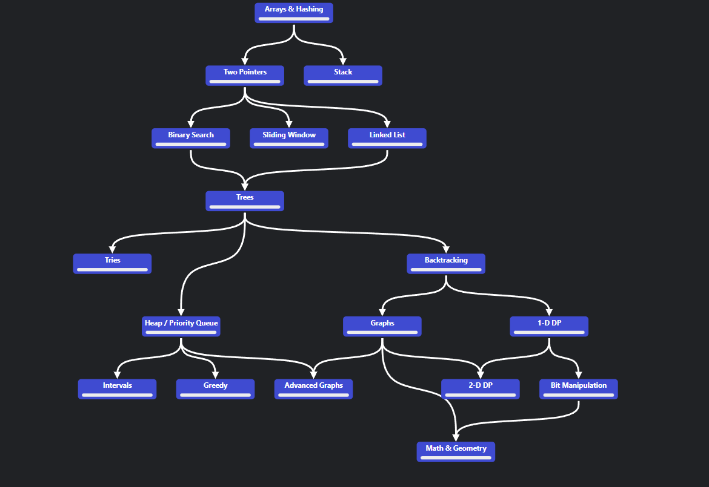

# Structure of The Category Problems

Those problem are organized by dependency. If the first line
is Array & Hashing, the second line depends on the first line. Excecpt
When in the final say "depends on Backtracking", it means that the problem
depends exclusive on Backtracking.

- Arrays & Hashing [Read](1.arrays_&_hashing/readme.md)
- Stack & Queue depends on Array & Hashing [Read](2.stack/readme.md)
- Two Pointers, does problems depend by Array & Hashing [Read](2.two_pointers/readme.md)
- [Linked List](3.linked_list/readme.md), [Binary Search](3.binary_search/readme.md) and [Sliding Window](3.sliding_windows/readme.md) depends on Two Pointers
- [Trees](4.trees/readme.md) depends on Linked List, Binary Search and Sliding Window
- [Tries](5.tries/readme.md), [Backtracking](5.backtracking/readme.md) are in the same level
- [Heap Priority Queue](6.heap_priority_queue/readme.md) depends on Trees
- [Graphs](6.graphs/readme.md) and [1-D Dynamic Programming](6.1d_dp/readme.md) depends on Backtracking
- Intervals, [Greedy](7.greedy/readme.md) Depends ON Heap Priority Queue
- Advanced Graphs depends on Graphs and And Heap Priority Queue
- 2-D Dynamic Programming and Bit Manipulation depends on 1-D Dynamic Programming
- Math and Geometry depends on 2-D Dynamic Programming, Bit Manipulation and Graphs

